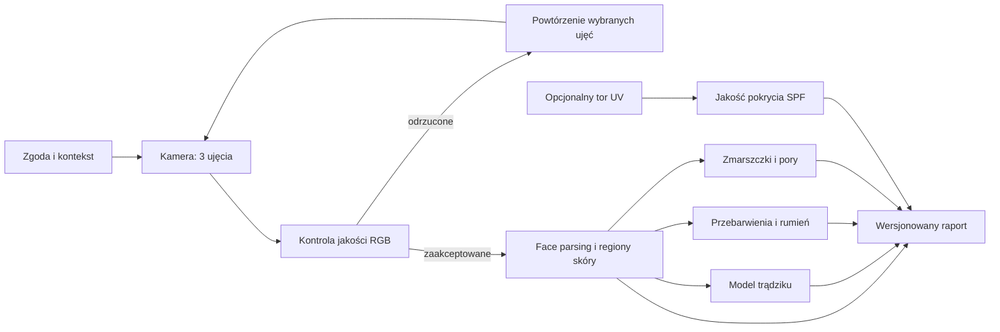

# Moduł skanowania skóry

Stan dokumentu: 2026-07-20
Właściciel funkcjonalny: do uzupełnienia
Status: działający demonstrator badawczy — kontrola jakości i analiza kosmetologiczna RGB

Ten katalog jest głównym punktem kontynuacji prac. Nie należy opisywać obecnego modułu jako narzędzia diagnostycznego ani jako systemu mierzącego SPF.

## Co działa

- strona klienta `/user/skan-skory` i pozycja w menu „Moja pielęgnacja”;
- jawna zgoda przed uruchomieniem kamery oraz zapis kontekstu: makijaż, SPF, niedawny zabieg;
- prowadzone wykonanie trzech zdjęć: `FRONT`, `LEFT`, `RIGHT`;
- podgląd oświetlenia w przeglądarce i możliwość wyboru zdjęcia z urządzenia;
- niezależna kontrola na serwerze: minimalna rozdzielczość, jasność, prześwietlenia, kontrast i przybliżona ostrość;
- żądanie powtórzenia wybranych ujęć, jeśli serwer odrzuci ich jakość;
- prywatna historia sesji, wynik jakości, wersjonowany raport JSON i usuwanie sesji wraz z plikami;
- prywatne pliki `/uploads/skin-scans/*` sprawdzane pod kątem właściciela;
- dostawca `quality-only` zwracający jawne `MODEL_NOT_CONFIGURED`, gdy serwis ML nie jest skonfigurowany;
- prywatny serwis Python/FastAPI z BiSeNet, Acne-LDS/ACNE04 i FFHQ-Wrinkle;
- rzeczywista analiza trądziku, zmarszczek oraz względnych wskaźników przebarwień i rumienia;
- wersje i status każdego modelu zapisane w raporcie sesji.

## Czego jeszcze nie ma

- detekcji obecności twarzy, landmarków i automatycznej weryfikacji kąta głowy;
- wykrywania makijażu lub filtra upiększającego;
- pełnej weryfikacji kąta głowy na podstawie landmarków;
- detektora pojedynczych zmian wytrenowanego na ACNE04-v2 (obecny Acne-LDS podaje ocenę nasilenia i estymowaną liczbę);
- osobnych, ekspercko wytrenowanych modeli przebarwień i rumienia — obecnie są to względne wskaźniki CIE Lab w masce skóry;
- modelu porów;
- obrazu UV lub integracji z urządzeniem do oceny rozprowadzenia filtra;
- klinicznej walidacji, kalibracji między urządzeniami i porównania zmian w czasie;
- panelu kosmetologa do przeglądu lub zatwierdzania raportów;
- automatycznej polityki retencji. Użytkownik może ręcznie usunąć sesję.

## Przepływ

1. `POST /api/skin-scans` tworzy sesję i zapisuje czas zgody, `consentVersion` oraz kontekst.
2. Przeglądarka wykonuje trzy zdjęcia. Podgląd jasności jest wyłącznie wskazówką UX.
3. `POST /api/skin-scans/:id/images` zapisuje pliki WebP i oblicza jakość na serwerze.
4. `POST /api/skin-scans/:id/complete` sprawdza komplet kątów i jakość.
5. Gdy dowolne ujęcie nie przejdzie kontroli, status to `NEEDS_RETAKE`.
6. Gdy materiał przejdzie kontrolę, aktywny dostawca tworzy wersjonowany raport. Przy `SKIN_ANALYSIS_URL` jest to `cosmo-skin-analysis/research-v1`; bez tej zmiennej pozostaje bezpieczny fallback `quality-only/quality-v1`.

Statusy sesji: `DRAFT`, `CAPTURING`, `NEEDS_RETAKE`, `COMPLETED`, `FAILED`.



W demonstratorze badawczym aktywne są face parsing, ocena trądziku, względne wskaźniki koloru skóry i segmentacja zmarszczek. Pory i SPF pozostają niedostępne.

## Najważniejsze pliki

- frontend strony: `apps/web/src/pages/user/SkinScan.tsx`;
- obsługa kamery: `apps/web/src/components/skin-scan/SkinScanCamera.tsx`;
- klient API i typy: `apps/web/src/api/skin-scans.api.ts`;
- router backendu: `apps/server/src/modules/skin-scans/skin-scans.router.ts`;
- logika sesji: `apps/server/src/modules/skin-scans/skin-scans.service.ts`;
- kontrola jakości: `apps/server/src/modules/skin-scans/skin-scans.quality.ts`;
- interfejs dostawcy: `apps/server/src/modules/skin-scans/skin-scans.provider.ts`;
- serwis inferencyjny: `services/skin-analysis/app.py`;
- pipeline analizy: `services/skin-analysis/analysis.py`;
- pobieranie zweryfikowanych wag: `services/skin-analysis/scripts/download_models.py`;
- rejestr ograniczeń wag: `services/skin-analysis/THIRD_PARTY_MODELS.md`;
- kontrakt raportu: `apps/server/src/modules/skin-scans/skin-scans.types.ts`;
- modele bazy: `apps/server/prisma/schema.prisma` (`SkinScanSession`, `SkinScanImage`);
- migracje: `apps/server/prisma/migrations/20260720120000_add_skin_scans/migration.sql` i `20260720130000_add_skin_scan_consent_version/migration.sql`.

## Kontrakt metryki

Każda metryka ma pola:

```ts
type SkinScanAnalysisMetric = {
  status: 'AVAILABLE' | 'MODEL_NOT_CONFIGURED' | 'UNAVAILABLE_WITH_RGB' | 'INSUFFICIENT_QUALITY';
  value: number | null;
  unit: string | null;
  confidence: number | null; // 0–1, tylko jeśli model jest skalibrowany
  modelVersion: string | null;
  message: string;
  details?: Record<string, unknown>;
};
```

Dozwolone jednostki trzeba ustalić przed wdrożeniem modelu. Proponowane:

- trądzik: `lesion_count`, osobno liczba zmian zapalnych i niezapalnych w `details`, oraz `grade_0_4`;
- przebarwienia, rumień: `skin_area_percent`;
- zmarszczki: `line_density_per_cm2` tylko po kalibracji skali; do MVP lepiej `normalized_line_density`;
- pory: `normalized_texture_score`, nie „rozmiar porów” bez skali fizycznej;
- SPF: `coverage_percent` wyłącznie dla zgodnego toru UV, nigdy dla zwykłego RGB.

Raport przechowuje `schemaVersion`, `analysisProvider`, `analysisVersion` i `modelVersions`. Historycznego raportu nie wolno przeliczać po cichu nową wersją modelu.

## Jak podłączyć kolejny model

1. Dodaj dostawcę implementującego `SkinScanAnalysisProvider`. Nie umieszczaj ciężkiego środowiska Python/PyTorch w procesie Express; preferowany jest osobny, prywatny serwis inferencyjny.
2. Dostawca powinien przyjmować identyfikator sesji i trzy prywatne ścieżki/strumienie obrazów. Serwis ML nie powinien otrzymywać publicznych URL-i.
3. Najpierw uruchom: normalizację orientacji i koloru → landmarki/kąt głowy → face parsing → maskę skóry → modele zadaniowe.
4. Każdy model zwraca własną wersję, status, wartość, jednostkę, skalibrowaną pewność oraz ostrzeżenia. Brak wyniku jest statusem, nie wartością zero.
5. Zaktualizuj typ `SkinScanAnalysis`, test kontraktu i UI. Nie usuwaj obsługi starszych `schemaVersion`.
6. Dodaj wpis do `MODEL-AND-DATA-REGISTER.md`: commit/wagi, źródła treningowe, licencje, zakres walidacji i znane ograniczenia.
7. Przed aktywacją produkcyjną uruchom tryb cienia: model liczy wyniki, ale użytkownik ich nie widzi; porównaj je z adnotacjami ekspertów.
8. Dopiero po akceptacji jakości zmień status metryki na `AVAILABLE`.

Przykładowy docelowy podział serwisu ML:

```text
preprocess-v1
├── face-landmarks-v1
├── face-parsing-v1
├── acne-detector-v1
├── pigmentation-segmentation-v1
├── redness-segmentation-v1
├── wrinkle-segmentation-v1
└── pore-texture-v1
```

## Minimalna walidacja przed pokazaniem wyniku

- osobny zbiór testowy niewykorzystany do treningu i doboru progów;
- wyniki per typ/odcień skóry, przedział wieku, płeć, model telefonu i warunki światła;
- detekcja: precision, recall, F1 i błąd liczby zmian; segmentacja: Dice/IoU i błąd procentu powierzchni;
- ocena powtarzalności: ten sam użytkownik, trzy zdjęcia w tej samej sesji i powtórka dzień po dniu;
- kalibracja confidence (np. ECE), progi `INSUFFICIENT_QUALITY` i analiza najgorszych przypadków;
- przegląd co najmniej dwóch niezależnych ekspertów oraz zapis zgodności między oceniającymi;
- test na danych z docelowej populacji i urządzeń. DDI/SCIN mogą wspierać audyt różnorodności, ale nie zastępują docelowego zbioru kosmetologicznych zdjęć twarzy.

## SPF i ograniczenia kamery

Zwykła kamera telefonu rejestruje obraz widzialny RGB. Nie należy z niego wyliczać pokrycia SPF ani rzeczywistego współczynnika ochrony. Badania wizualizujące rozprowadzenie produktu używają kamer UV i kontrolowanych warunków. Nawet obraz UV może wspierać ocenę równomierności pokrycia, ale nie zastępuje standaryzowanego pomiaru SPF/UVA-PF. Punkt startowy: [badanie UV photography](https://pmc.ncbi.nlm.nih.gov/articles/PMC10501517/) i [ISO 24443](https://www.iso.org/standard/75059.html).

## Prywatność i zgodność

Zdjęcia twarzy i wnioskowane informacje o stanie skóry są danymi wysokiego ryzyka prywatności. Przed produkcją potrzebna jest ocena prawnika/inspektora ochrony danych, udokumentowany cel i podstawa przetwarzania, minimalizacja, retencja, eksport/usunięcie danych, szyfrowanie kopii zapasowych, rejestr dostępu i procedura naruszeń. Punkt odniesienia: [RODO — tekst rozporządzenia](https://eur-lex.europa.eu/eli/reg/2016/679/oj).

Jeśli produkt zacznie deklarować rozpoznawanie choroby, diagnozę, dobór leczenia albo wpływać na decyzje kliniczne, trzeba oddzielnie ocenić kwalifikację jako oprogramowanie medyczne. Aktualny punkt odniesienia Komisji Europejskiej: [MDCG 2019-11 rev.1](https://health.ec.europa.eu/latest-updates/update-mdcg-2019-11-rev1-qualification-and-classification-software-regulation-eu-2017745-and-2025-06-17_en). Sama etykieta „nie jest diagnozą” nie zastępuje analizy faktycznego przeznaczenia produktu.

## Uruchomienie modeli lokalnie

Z katalogu głównego repozytorium:

```powershell
cd services/skin-analysis
python -m venv .venv
.venv\Scripts\python.exe -m pip install -r requirements-dev.txt
.venv\Scripts\python.exe scripts/download_models.py
$env:SKIN_ANALYSIS_API_KEY = "lokalny-sekret-minimum-16-znakow"
.venv\Scripts\python.exe -m uvicorn app:app --host 127.0.0.1 --port 8010
```

W `apps/server/.env` ustaw:

```dotenv
SKIN_ANALYSIS_URL=http://127.0.0.1:8010
SKIN_ANALYSIS_API_KEY=lokalny-sekret-minimum-16-znakow
SKIN_ANALYSIS_TIMEOUT_MS=90000
```

Klucz musi być identyczny po obu stronach. Portu `8010` nie należy wystawiać publicznie. Każdy proces roboczy ładuje osobną kopię wag, dlatego na CPU zalecany jest jeden worker.

ACNE04-v2 nie jest uruchamiane w czasie analizy: repozytorium publikuje adnotacje do treningu detektora, nie gotowe wagi. Obecny wynik trądziku pochodzi z Acne-LDS wytrenowanego na ACNE04.

## Weryfikacja po wdrożeniu zmian

Z katalogu `services/skin-analysis`:

```powershell
.venv\Scripts\python.exe -m pytest tests
.venv\Scripts\python.exe scripts/download_models.py
```

Z katalogu `apps/server`:

```bash
pnpm prisma:generate
pnpm exec prisma migrate deploy
pnpm build
pnpm vitest run src/modules/skin-scans/skin-scans.quality.test.ts
```

Z katalogu `apps/web`:

```bash
pnpm build
```

Kamera internetowa działa tylko w bezpiecznym kontekście HTTPS lub na `localhost`. Reverse proxy musi dopuszczać żądania multipart do endpointu skanów; jedno zdjęcie ma limit 5 MB.
